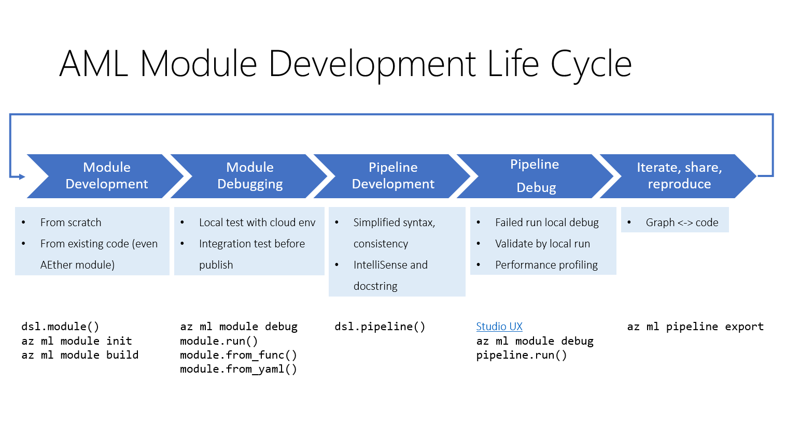

# Module overview

## Overview of pipeline and module

A pipeline is a description of a machine learning (ML) workflow, including all of the modules of the workflow and how they work together. The pipeline includes the definition of the inputs (parameters) required to run the pipeline and the inputs and outputs of each module.

A module is an implementation of a pipeline task. A module represents a step in the workflow. Each module takes one or more inputs and may produce one or more outputs. A module consists of an interface (inputs/outputs), the implementation (source code, command-line arguments and environment to run the module ) and metadata (name, description).

Azure machine learning modules can be reused across multiple projects and AML workspace. This is achieved through module specification in YAML format, which describes all information(source code, environment, interface) needed to reproduce the module. A module is attached to a workspace through register with module YAML spec. After registeration, customer can consume the module in designer UI. 

## Module & pipeline development lifecycle
Module & pipeline development is an iterative process. It includes build module, test module, build pipeline, test pipeline and share/reuse. We have provide several CLI commands and SDK functions to boost the efficiency in the development lifecycle.

### Module development

[video-how-to-build-new-module]()

[sample-notebook]()

|CLI Command|Purpose|
| -----------| ----------- |
|az ml module init| Initialize a template dsl module project. The template contains following useful files in module development process.   - module_name.py: module source code template   - module_name.spec.yaml: module spec in yaml format. Needed to register the module.   - module_name_test.ipynb: template test notebook for the module   - module_name_test.py: unit test template for the module  |
|az ml module build|Automatically build yaml spec from source code that wrapped as dsl module. With this command, customer don't need to edit the yaml spec manually. |

### Debug module
[video-how-to-debug-module]()

|CLI Command|Purpose|
| -----------| ----------- |
|az ml module debug||

|SDK function|Purpose|
| -----------| ----------- |
|module.from_func|Load module from a function. Then you can run the module without register it to workspace.|
|module.from_yaml|Load module from yaml spec. Then you can run the module without register it to workspace. |
|module.run|Run module in your local Python environment or local docker container.|

### Build pipeline
[video-how-to-build-pipeline-with-module]()

dsl.pipeline()

### Debug pipeline
[video-how-to-debug-pipeline]()

pipeline.run()

### Share and resue
[video-how-share-reuse-module]()

az ml pipeline export

Designer UX 
